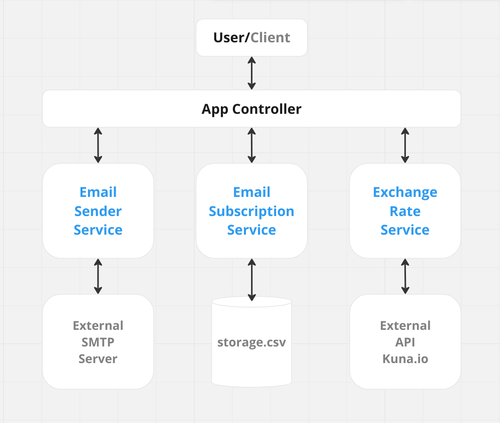

# gses2-app API обміну BTC на UAH

 

Це API, яке надає поточний курс обміну між Bitcoin та українською гривнею (UAH). Воно дозволяє користувачам підписуватися на оновлення курсу та отримувати ці оновлення по електронній пошті.

## Встановлення

1. Склонуйте репозиторій до бажаного місця:

   ```bash
   git clone https://github.com/lumenalux/gses2-app.git gses2-api
   cd gses2-api
   ```

2. Побудуйте Docker-образ:

   ```bash
   docker build --tag gses2-app .
   ```

## Використання

1.  Запустіть Docker-контейнер:

    ```bash
    docker run -p 8080:8080 gses2-app
    ```

2.  Використання API:

- Отримати поточний курс BTC до UAH:

  ```bash
  curl localhost:8080/api/rate
  ```

- Підписатися на оновлення курсу:

  ```bash
  curl -X POST -d "email=subscriber@email.com" localhost:8080/api/subscribe
  ```

- Надіслати оновлення курсу всім підписникам:

  ```bash
  curl -X POST localhost:8080/api/sendEmails
  ```

## Додатково про використання API

Для докладних прикладів того, як працює API, включно зі скріншотами, будь ласка, перегляньте файл [API_USAGE.md](./API_USAGE.md).

## Налаштування додатку

Додаток використовує файл `config.yaml` для налаштування SMTP-сервера та електронної пошти. Оновіть налаштування в файлі `config.yaml`, щоб використовувати свій власний SMTP-сервер для надсилання оновлень по електронній пошті.

## Налаштування шаблону електронної пошти

Файл `config.yaml` містить налаштування для SMTP-сервера, а також вміст повідомлень електронної пошти, які надсилаються підписникам. Це включає шаблон для тіла електронного листа, який використовує синтаксис text/template Go. Додаток замінює `{{.Rate}}` на поточний курс обміну BTC на UAH перед надсиланням електронної пошти.

Ось як виглядає файл `config.yaml`:

```yaml
smtp:
  host: smpt-server.example.com
  port: 465
  user: <user>
  password: <password>
email:
  from: no.reply@currency.info.api
  subject: BTC to UAH exchange rate
  body: The BTC to UAH exchange rate is {{.Rate}} UAH per BTC
```

У секції `email`:

- `from`: Це поле вказує адресу електронної пошти, яка буде відображатися як відправник листа.
- `subject`: Це поле містить рядок теми листа.
- `body`: Це поле містить тіло листа. Будь-який екземпляр `{{.Rate}}` в цьому полі буде замінений на поточний курс обміну BTC на UAH при надсиланні листа.

Якщо ви бажаєте змінити вміст електронного листа, просто відредагуйте поля `subject` та/або `body` за бажанням.

> **Note**
> Не забудьте перебудувати Docker-образ, щоб застосувати нові налаштування після внесення змін до `config.yaml`.

> **Warning**
> Важливо зберігати шаблон `{{.Rate}}` у полі `body`, якщо ви хочете включити поточний курс обміну в електронному листі.

## Опис API

Це API надає три ендпоінти, які виконують різні операції:

1.  **GET** `/api/rate`: Цей ендпоінт використовується для отримання поточного обмінного курсу від BTC до UAH.

2.  **POST** `/api/subscribe`: Цей ендпоінт використовується для додавання нової адреси електронної пошти до списку підписників.

3.  **POST** `/api/sendEmails`: Цей ендпоінт надсилає електронний лист з поточним обмінним курсом від BTC до UAH всім підписникам.

## Як це працює

Файл `main.go` є точкою входу для програми Go. Він створює екземпляри вищезазначених сервісів та впроваджує їх у `AppController`. Потім він співставляє методи контролера на HTTP-ендпоінти та запускає сервер.

## Архітектура



- **App Controller**: Контролер обробляє HTTP-запити та відповіді. Він використовує сервіси для виконання бізнес-логіки.
- **Exchange Rate Service**: Цей сервіс взаємодіє з API [Kuna.io](https://kuna.io/trade/BTC_UAH), щоб отримати обмінні курси BTC до UAH.
- **Email Subscription Service**: Цей сервіс керує операціями додавання та отримання підписників з файлової бази даних `storage.csv`.
- **Email Sender Service**: Цей сервіс взаємодіє з зовнішнім SMTP-сервером для надсилання електронних листів.
