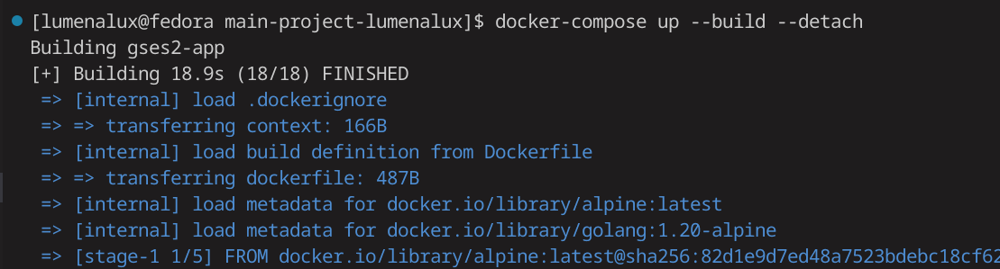
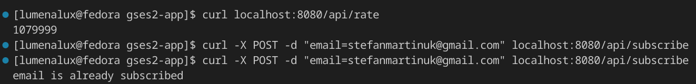
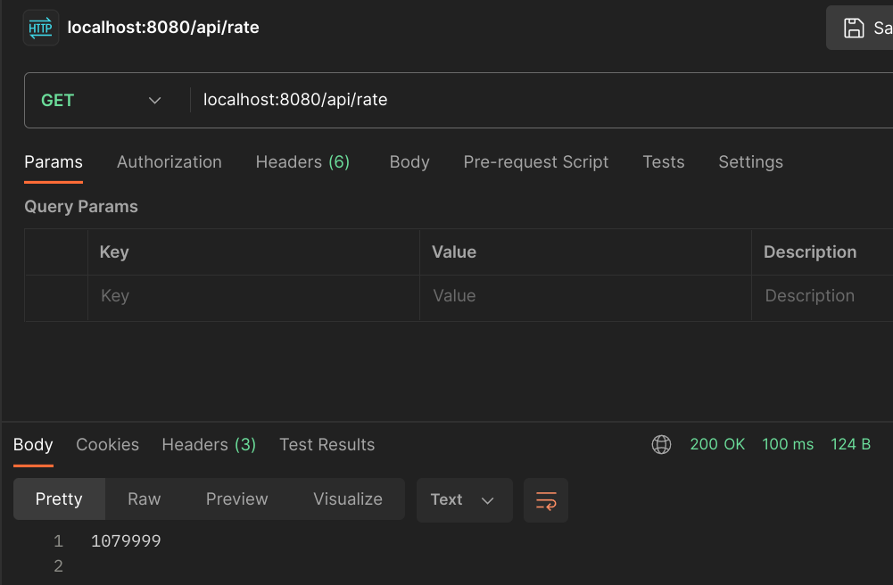
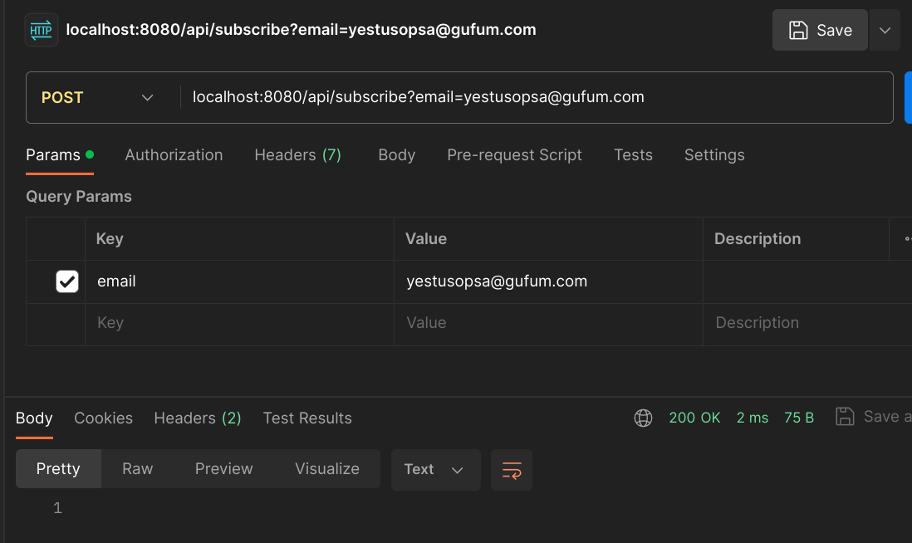
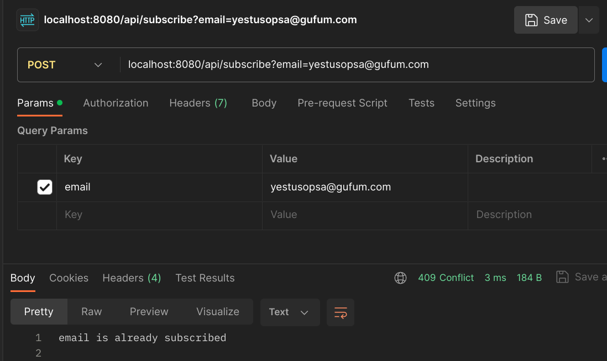
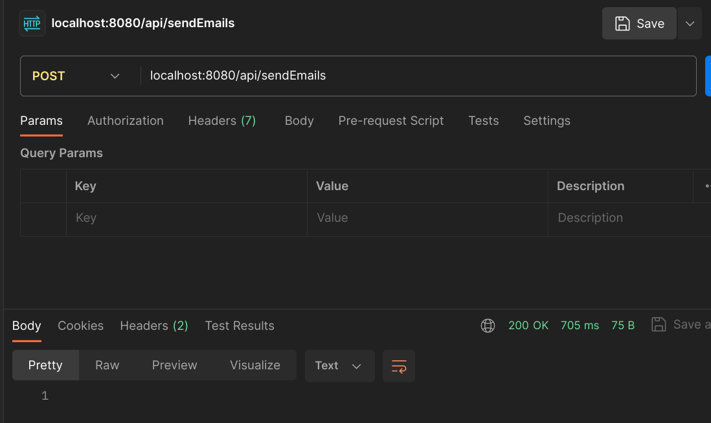
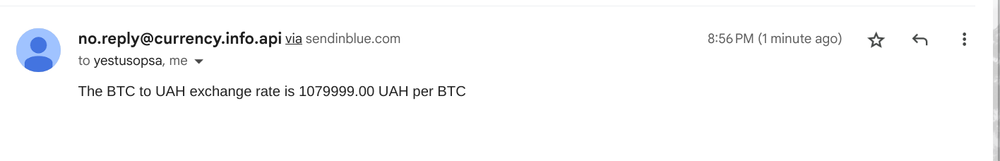
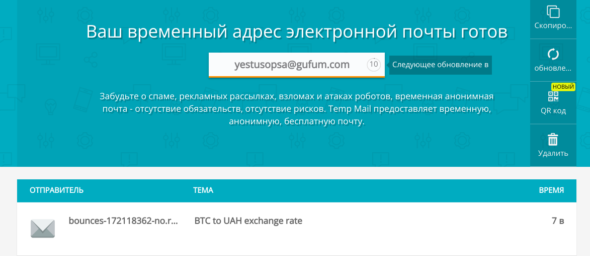
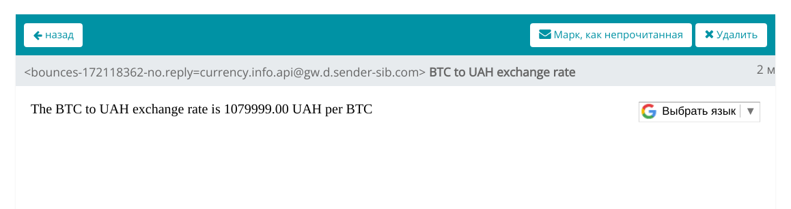

# API Usage Example

## Docker compose up

## Testing API using curl command]

## Rate response

## Subscribe response

## Send emails response

## Receiving the message on gmail

> **Note**
> If you didn't receive the message, check spam

## Receiving the message on a different email

